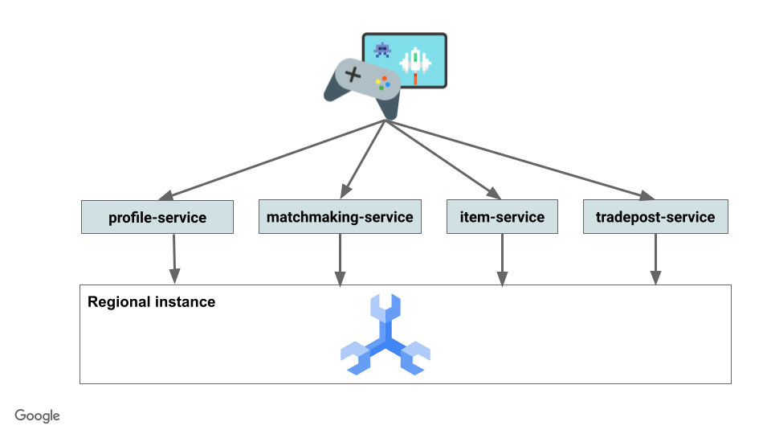
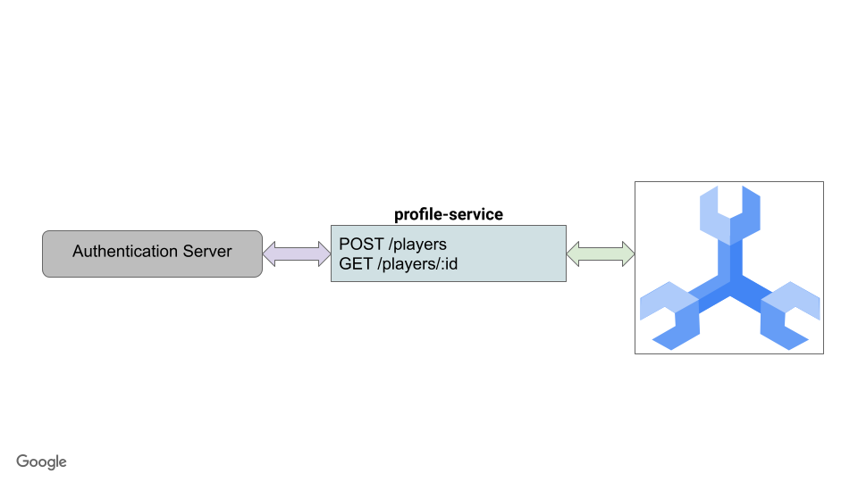
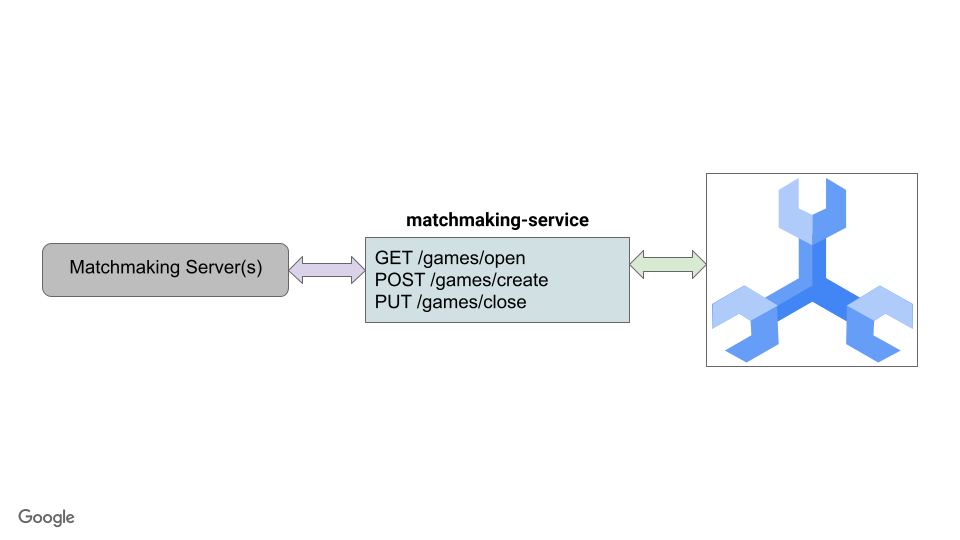
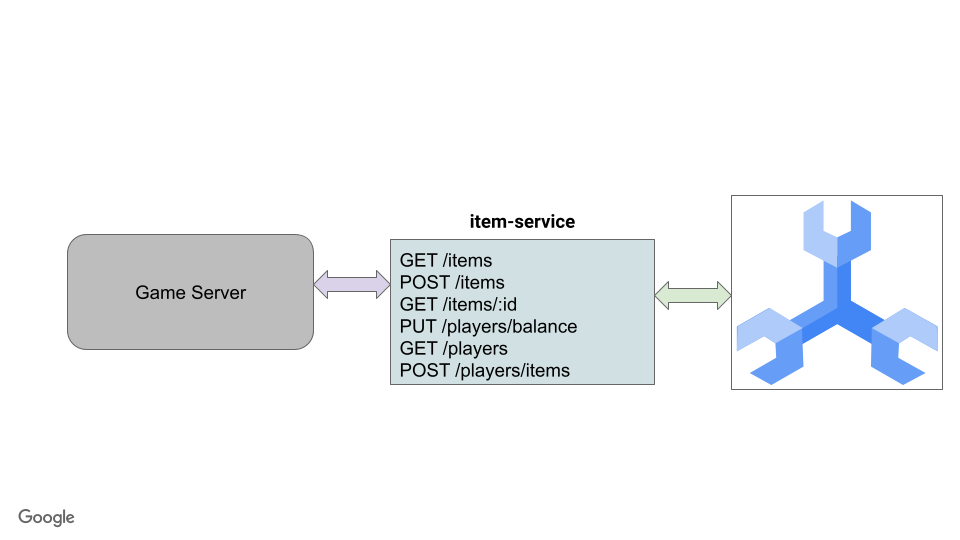
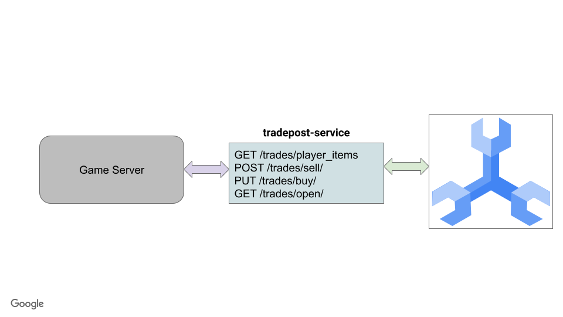
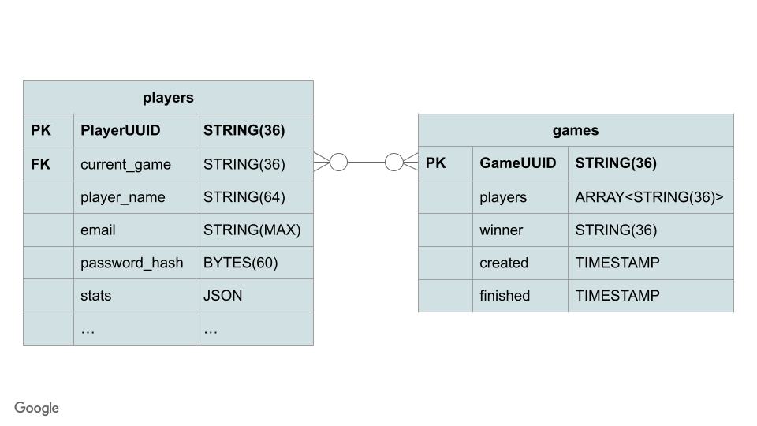
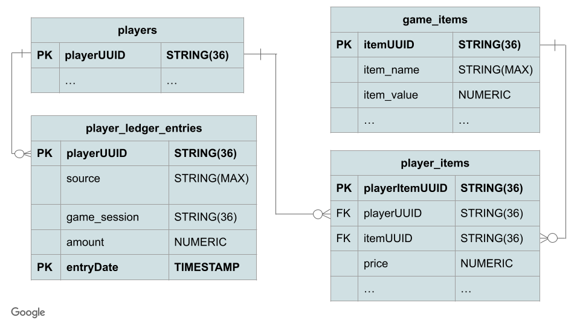
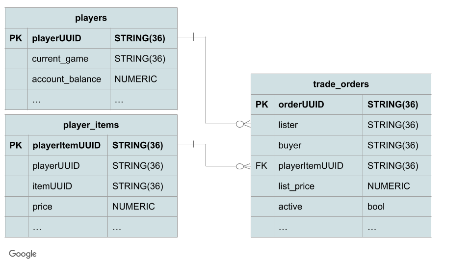

# Spanner Gaming Samples

This repository contains sample code for the following use-cases when using Cloud Spanner for the backend:

- Player creation and retrieval
- Basic game creation and matchmaking that tracks game statistics like games won and games played
- Item and currency acquisition for players in active games
- Ability to buy and sell items on a tradepost



## REST endpoints

These are the REST endpoints exposed by backend services

### profile service


### matchmaking service


### item service


### tradepost service


## Spanner schema

The Cloud Spanner schema that supports the backend services looks like this.

### Players and games


### Items and player ledger


> **NOTE:** Players table is repeated to show relation

### Trades and player items


> **NOTE:** Players and player_items tables are repeated to show relations

## How to use this demo

This demo is meant to show you a working application with load against a Cloud Spanner database. To use this, you must:
- Set up the infrastructure using either the below options
  - Terraform to get a complete Spanner, GKE Autopilot and Cloud Deploy setup in your project
  - gcloud command line to get a minimal setup of Cloud Spanner. Services and workloads will run locally.
- Deploy the services
- Deploy the workload generators
- Generate load and observe Cloud Spanner behavior.
- Clean up based on whether you deployed with gcloud or Terraform.

### Setup infrastructure

First you will want to set a variable to make it easier to navigate this directory.

```bash
export DEMO_HOME=$(pwd)
```

Before you set up the infrastructure, it is important to enable the appropriate APIs using the gcloud command line.

You must [install and configure gcloud](https://cloud.google.com/sdk/docs/install-sdk).

When that's complete, ensure your gcloud project is set correctly.

```bash
gcloud config set project <PROJECT_ID>
```

> **NOTE:** You can find your PROJECT_ID in [Cloud Console](https://cloud.google.com/resource-manager/docs/creating-managing-projects#identifying_projects).

Then you can set up the Spanner infrastructure using either the gcloud command line or Terraform. Instructions for both are below.

#### Gcloud command line

To create the Spanner instance and database using gcloud, issue the following commands:

```bash
gcloud spanner instances create sample-instance --config=regional-us-central1 --description=gaming-instance --processing-units=500

gcloud spanner databases create --instance sample-instance sample-game
```

> **NOTE:** The above command will create an instance using the us-central1 [regional configuration](https://cloud.google.com/spanner/docs/instance-configurations) with a compute capacity of 500 processing units. Be aware that creating an instance will start billing your account unless you are under Google Cloud's [free trial credits](https://cloud.google.com/free).

#### Terraform
A terraform file is provided that creates the appropriate resources for these samples.

Resources that are created:
- Spanner instance and database based on user variables in main.tfvars
- GKE cluster to run the services
- Artifact Registry to store the images for the services and the workloads
- Cloud Deploy pipeline to deploy the services and workloads to the GKE cluster

To set up the infrastructure, do the following:

- Copy `infrastructure/terraform.tfvars.sample` to `infrastructure/terraform.tfvars`
- Modify `infrastructure/terraform.tfvars` for PROJECT and instance configuration
- `terraform apply` from within infrastructure directory

```bash
cd $DEMO_HOME/infrastructure
terraform init
cp terraform.tfvars.sample terraform.tfvars
vi terraform.tfvars # modify variables

# Authenticate to gcloud services so Terraform can make changes
gcloud auth application-default login

terraform apply
```

### Schema management
Schema is managed by [Wrench](https://github.com/cloudspannerecosystem/wrench).

There are two methods to deploy the schema: Cloud Build and local.

> **NOTE:** The schema must be in place for the services to work. Do not skip this step!

#### Cloud Build schema management

To use cloud build schema management, run the cloud build commands:

```bash
cd $DEMO_HOME/schema
gcloud builds submit --config=cloudbuild.yaml
```

> **NOTE:** You must have used the Terraform setup to ensure the cloud build IAM permissions are correct.

#### Local schema management
Local schema management simply means you run the migrations from your local machine. The schema changes still get applied to the remote Cloud Spanner instance.

First, install wrench.

After installing wrench, migrate the schema by running the `./scripts/schema.sh` file (replace project/instance/database information with what was used in terraform file):

```bash
export SPANNER_PROJECT_ID=YOUR_PROJECT_ID
export SPANNER_INSTANCE_ID=YOUR_INSTANCE_ID
export SPANNER_DATABASE_ID=YOUR_DATABASE_ID
./scripts/schema.sh
```

### Deployment
You can deploy the services and workloads to the GKE cluster that was configured by Terraform, or you can deploy them locally.

To deploy locally, follow the [instructions here](./docs/local.md).

#### Deploy services to GKE

> **NOTE:** Deployment to GKE requires the Terraform setup have been completed above.

To deploy the services to GKE, use `gcloud build` from the `backend_services` directory:

```bash
cd $DEMO_HOME/backend_services
gcloud builds submit --config=cloudbuild.yaml
```

> **NOTE:** If the `cloudbuild.yaml` file doesn't exist in this directory, make sure to run the Terraform setup step again.

Once the services are deployed you can deploy the workloads to GKE.

#### Deploy workloads to GKE

To deploy the workloads to GKE, use `gcloud build` from the `workloads` directory:

```bash
cd $DEMO_HOME/workloads
gcloud builds submit --config=cloudbuild.yaml
```

> **NOTE:** If the `cloudbuild.yaml` file doesn't exist in this directory, make sure to run the Terraform setup step again.

For more information on running the workloads, follow [these instructions](./docs/workloads.md).

> **NOTE:** It will take some time time to complete the build.

### Kubectl
To interact with the GKE cluster, ensure kubectl is installed.

Once that is done, authenticate to GKE with the following commands:

```bash
export USE_GKE_GCLOUD_AUTH_PLUGIN=True
export GKE_CLUSTER=sample-game-gke # change this based on the terraform configuration
gcloud container clusters get-credentials $GKE_CLUSTER --region us-central1
kubectl get namespaces
```

If there are no issues with the kubectl commands, kubectl is properly authenticated.

## Cleaning up

### GCloud command line

If the Spanner instance was created using the gcloud command line, it can be delete using gcloud:

```bash
gcloud spanner instances delete sample-instance
```

### Terraform

If the infrastructure was created using terraform, then from the `infrastructure` directory you can destroy the infrastructure.

```bash
cd $DEMO_HOME/infrastructure
terraform destroy
```

### Clean up builds and tests
The Makefile provides a `make clean` command that removes the binaries and docker containers that were created as part of building and testing the services as described in the [local setup](./docs/local.md).

```bash
make clean
```
